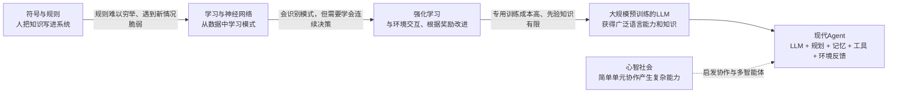

# 第二章：智能体发展史

> 学习重点不在背诵年代、人物和系统名称，而在理解：每一种智能范式试图解决什么问题，又留下了什么局限；现代智能体为何会组合规则、学习、规划、记忆和工具。

## 一、发展史

智能体的发展不是新技术把旧技术彻底取代，而是不断补足旧方法的短板：



把它记成一句话：**知识可以手工编码，也可以从数据中学习；智能体还要在环境中行动、接收反馈，并能把多个能力组织起来。**

## 二、符号主义：把知识和规则明确写出来

早期符号主义认为，智能可以通过表示符号、操作符号和执行逻辑推理来实现。物理符号系统假说进一步提出：符号处理与通用智能之间存在紧密关系。

### 专家系统

专家系统把领域知识写成“如果……那么……”规则，通常由两部分组成：

- **知识库**：存放事实与规则。
- **推理机**：根据已有事实匹配并执行规则。

两种常见推理方向：

- **正向链**：从已有事实出发，逐步推出结论，属于数据驱动。
- **反向链**：先设定想证明的目标，再倒推需要哪些条件，属于目标驱动。

例如，MYCIN 是用于辅助细菌感染诊断的专家系统。它展示了规则系统在边界清晰的专业领域可以很有用，但建立和维护知识库需要专家参与，系统也容易受限于已有规则。

### SHRDLU 与封闭世界

SHRDLU 能在“积木世界”里理解自然语言指令、记住上下文、规划移动积木的步骤并执行动作。它的重要启发是：语言理解、记忆、规划和行动可以集成在一个闭环中。

但它主要在规则明确、范围有限的积木世界里工作。离开这个微型环境，原有知识和规则就难以应付真实世界的复杂变化。**受控环境里的成功，不等于已经理解开放世界。**

### 符号系统的主要局限

1. **知识获取瓶颈**：把专家经验整理成完整规则既昂贵又困难，很多常识和经验难以明确表达。
2. **常识不足**：没有写入系统的知识，系统通常不能自然地补上。
3. **框架问题**：动作改变环境后，系统还要判断哪些状态变了、哪些没有变；真实环境里的变化很难全部列举。
4. **脆弱性**：遇到规则覆盖不到的新情形时，表现容易失效；规则增加后也会出现冲突和维护负担。

## 三、ELIZA：看起来会聊天，不代表真的理解

ELIZA 是早期规则聊天程序。它会根据关键词和句式匹配用户输入，再用预设模板改写成回应。简化流程如下：

```text
用户输入
  → 找关键词或匹配句式
  → 提取输入中的片段
  → 转换代词
  → 填入回应模板
```

例如，把“我需要帮助”匹配到相应规则后，可能生成“你为什么需要帮助？”ELIZA 不必理解用户处境，也能通过开放式提问营造出会倾听的感觉。这种“人把理解能力投射给程序”的现象常被称为 **ELIZA 效应**。

ELIZA 的练习价值在于亲手看见规则机器的工作方式。它能让我们区分**语言表面上的连贯**与**对含义、上下文和真实状态的理解**。增加规则能覆盖更多句子，但难以覆盖开放域语言的无穷组合。

## 四、心智社会：复杂智能可以由简单部分协作产生

马文·明斯基提出“心智社会”观点：智能不一定来自一个全知全能的中心，而可能来自许多简单、专门的过程彼此协作。每个小单元只负责有限任务；组合起来后，系统可以表现出复杂能力。

例如，搭积木可以拆为寻找积木、抓取、移动、放置等子任务。负责抓取的部分不必理解“搭塔”的整体目标，协调这些步骤后仍可以完成目标。

这类思想启发了**分布式智能和多智能体系统**：多个独立单元可以分工、通信和协作。不过协作也带来协调、通信、冲突处理和局部故障等问题。本章这里主要是思想背景，不需要把它等同于当下每一种多 Agent 框架。

## 五、从规则转向学习

### 联结主义与神经网络

符号主义把知识显式写成规则；联结主义则用神经网络中的连接权重分布式地表示知识，通过数据训练调整权重。它让机器能从图像、声音和文本等大量样本中学出模式，尤其提升了感知与识别能力。

简单对比：

| 思路 | 能力从哪里来 | 典型优势 | 典型难点 |
|---|---|---|---|
| 符号主义 | 人编写的事实和规则 | 规则清晰，特定领域可解释 | 知识难收集，规则外情况脆弱 |
| 联结主义 | 数据训练出的参数和模式 | 能从大量样本中学习复杂模式 | 不容易直接解释，训练数据和泛化很关键 |

### 强化学习

神经网络擅长从数据中识别模式，但智能体还要连续地做决策。强化学习让智能体与环境交互，根据行动后的奖励调整策略：

```text
观察状态 → 选择行动 → 环境变化并给出奖励 → 更新策略 → 再次行动
```

核心概念：**智能体、环境、状态、行动、奖励、策略**。它优化的通常是长期累积回报，而非只追求眼前一步的奖励。AlphaGo 自我对弈的例子说明了系统可以从反复试错和胜负反馈中改进策略。

与监督学习的简单区别：监督学习通常需要带有正确答案的示例；强化学习可以通过与环境交互获得奖励信号，但奖励设计、探索和训练成本都可能很难处理。

### 预训练与大语言模型

预训练先让模型从海量文本中学习通用语言模式和知识，再用提示示例或进一步训练适配具体任务。它降低了每个任务都从头准备标注数据的需求，也让模型具备较广泛的语言能力。

但要注意：模型生成流畅答案，不代表它掌握的事实一定可靠；预训练所得知识也不等于实时信息或可核验的数据库。因此，在需要最新信息或精确事实时，现代 Agent 往往还要调用搜索、数据库或业务 API。

## 六、现代 LLM Agent：把模型放进“感知—思考—行动—反馈”循环

大语言模型本身负责理解和生成；作为 Agent 的系统还需要让它接收环境信息、选择行动、调用工具，并根据返回结果决定下一步：

```text
环境 / 用户
    ↓ 观察
感知 → LLM推理与规划 ←→ 记忆
              ↓ 决策
          工具 / 执行
              ↓ 结果与环境变化
          新一轮观察
```

这一循环和第一章的 **Thought–Action–Observation** 对应：

- **Thought**：结合目标、已有信息与记忆，判断下一步。
- **Action**：调用工具或采取其他行动。
- **Observation**：读取工具结果或环境变化，再决定是否继续。

现代 Agent 并不是只靠某一种历史范式：神经网络提供语言能力，符号化的计划和工具接口提供可执行结构，记忆保留任务信息，环境反馈帮助系统修正下一步。这种组合仍有局限，模型可能判断错误、工具可能失败，循环也需要限制和检查。

## 七、本章需要记住的结论

1. **规则系统擅长明确、稳定、边界清楚的问题**，但知识难以穷举，遇到新情况容易脆弱。
2. **ELIZA 能制造会理解的印象，却主要依靠模式匹配**；对话像人，不足以证明系统理解了内容。
3. **复杂智能可以由多个简单能力协作产生**，这是理解多智能体思想的一条线索。
4. **神经网络从数据中学习模式，强化学习从行动反馈中学习决策**，两者解决的问题不完全相同。
5. **LLM 提供语言理解和生成能力，但现代 Agent 还要有规划、记忆、工具和反馈闭环**。
6. 发展史的核心线索是“能力如何获得”：**手工编码 → 从数据学习 → 与环境交互学习 → 把模型接入可行动的系统**。

## 八、和后续章节的关系

本章主要建立历史背景。后面更值得投入精力的是理解 LLM 的基本工作方式、Agent 如何规划与调用工具，以及怎样处理记忆、反馈和可靠性。学到具体架构时，可以回想本章对应的历史问题：系统为什么需要记忆？为什么要用工具验证？为什么要控制行动循环？这些设计往往是在弥补某种能力缺口。

**参考**：Datawhale《Hello-Agents》[第二章：智能体发展史](https://datawhalechina.github.io/hello-agents/#/./chapter2/%E7%AC%AC%E4%BA%8C%E7%AB%A0%20%E6%99%BA%E8%83%BD%E4%BD%93%E5%8F%91%E5%B1%95%E5%8F%B2)。
